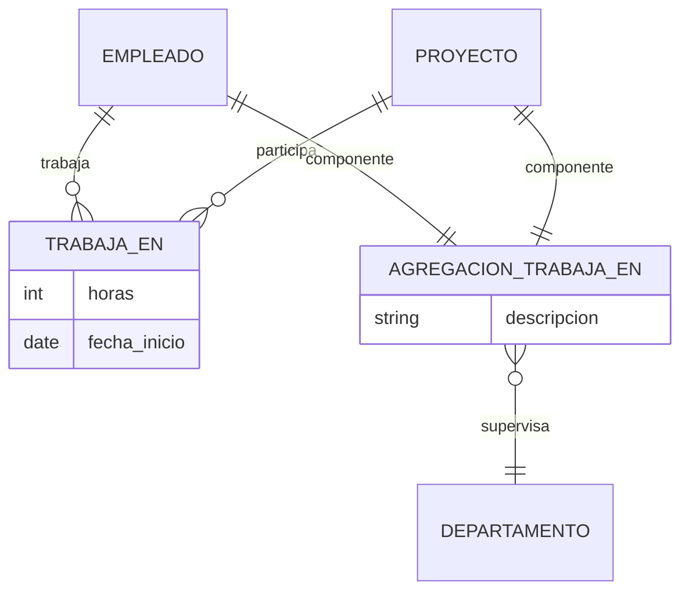

🔷 ¿Qué es la Agregación?
En un modelo entidad-relación (E/R), la agregación es un mecanismo que permite tratar una relación como si fuera una entidad, cuando esa relación participa en otra relación.

Se usa para representar situaciones más complejas, donde una relación necesita ser relacionada con otra entidad. La agregación proporciona un nivel de abstracción superior, donde agrupamos una relación con sus entidades participantes y la tratamos como una unidad.

🔶 Ejemplo explicado: Agregación con PROYECTO, EMPLEADO y DEPARTAMENTO
Supongamos el siguiente escenario:

Un EMPLEADO puede trabajar en uno o más PROYECTOS.

Esta relación se llama TRABAJA_EN. Puede tener atributos, como: horas, fecha_inicio, etc.

Ahora bien, cada relación de trabajo entre un EMPLEADO y un PROYECTO es supervisada por un DEPARTAMENTO.

Este último punto es lo que complica la situación: no es que el DEPARTAMENTO supervise al EMPLEADO o al PROYECTO en sí, sino a la relación específica de trabajo entre ambos.

🧩 ¿Cómo modelar esto?
Sin agregación:
No se puede hacer directamente, porque en los modelos E/R una relación no puede participar directamente en otra relación. Es decir, no puedes conectar una relación (como TRABAJA_EN) a otra entidad (DEPARTAMENTO) sin usar alguna técnica especial.

Con agregación:
Aquí es donde entra la agregación. Hacemos lo siguiente:

Modelamos la relación TRABAJA_EN entre EMPLEADO y PROYECTO.

Creamos una agregación de esta relación (y las entidades que participan), como si fuera una nueva "superentidad".

Luego, conectamos esa agregación con DEPARTAMENTO mediante una nueva relación, por ejemplo: SUPERVISA.

TRABAJA_EN con sus entidades relacionadas (EMPLEADO, PROYECTO) forman una agregación.

Esta agregación se relaciona con DEPARTAMENTO mediante SUPERVISA.

🎯 ¿Por qué usar agregación?
Porque necesitamos representar una relación entre relaciones (algo que no está permitido directamente).

Para mantener el modelo limpio, comprensible y correctamente estructurado.

Para capturar restricciones del mundo real que involucran contextos específicos de relaciones (como la supervisión de un trabajo en un proyecto por un departamento).

✅ Resumen final
Elemento	Descripción
EMPLEADO	Entidad que representa a los trabajadores
PROYECTO	Entidad que representa los proyectos
TRABAJA_EN	Relación entre EMPLEADO y PROYECTO, puede tener atributos
DEPARTAMENTO	Entidad que supervisa las tareas específicas
AGREGACIÓN	Combinación de TRABAJA_EN con sus entidades para poder relacionarla con DEPARTAMENTO

