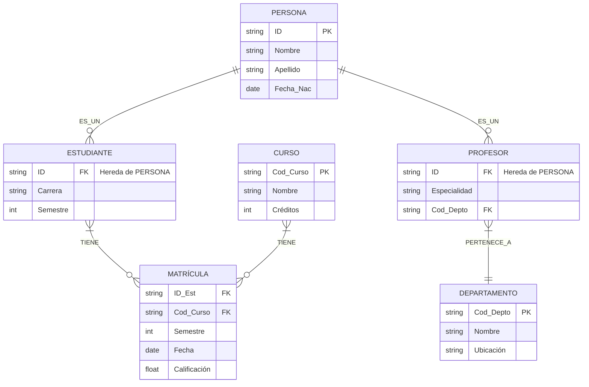

# **Documento: Modelado de Base de Datos para Sistema Universitario**  
**Autor**: Alberto Mozo (Deep Seek IA)
**Fecha**: 2025-05-02

---

## **1. Enunciado del Ejercicio**  
### **Contexto**  
La universidad "UNI-Model" necesita diseñar una base de datos para gestionar:  
- **Personas** (estudiantes y profesores).  
- **Departamentos académicos**.  
- **Cursos** impartidos.  
- **Matrículas** de estudiantes en cursos.  

### **Requisitos**  
1. **Entidades principales**:  
   - Todo **profesor** o **estudiante** es una **persona** (con datos básicos: ID, nombre, apellido, fecha de nacimiento).  
   - Los **profesores** pertenecen a un **departamento** y tienen una especialidad.  
   - Los **estudiantes** tienen una carrera y semestre.  
   - Los **cursos** tienen código, nombre y créditos.  

2. **Relaciones**:  
   - Un profesor puede impartir múltiples cursos (no modelado aquí para simplificar).  
   - Un estudiante se matricula en varios cursos (y viceversa), con fecha y calificación.  

3. **Reglas de negocio**:  
   - La matrícula es una entidad débil (su identidad depende del estudiante y el curso).  
   - La herencia debe reflejar que estudiantes y profesores son subtipos de persona.  

---

## **2. Solución Definitiva: Diagrama E/R**  
### **Notación utilizada**: Chen + Crow’s Foot para cardinalidades.  



---

## **3. Explicación de Elementos Clave**  
### **Entidades y Herencia**  
- **`PERSONA`**: Superclase con atributos comunes.  
- **`ESTUDIANTE` y `PROFESOR`**: Subclases que heredan `ID` como PK y añaden atributos específicos.  

### **Relaciones**  
- **`PERTENECE_A`**: Un profesor pertenece a **un** departamento (cardinalidad 1:N).  
- **`MATRÍCULA`**: Entidad débil con PK compuesta (`ID_Est + Cod_Curso + Semestre`).  

### **Atributos en Relaciones**  
- La relación `MATRÍCULA` almacena `Fecha` y `Calificación`.  

---

## **4. Script SQL para Implementación**  
```sql
CREATE TABLE PERSONA (
    ID VARCHAR(10) PRIMARY KEY,
    Nombre VARCHAR(50),
    Apellido VARCHAR(50),
    Fecha_Nac DATE
);

CREATE TABLE DEPARTAMENTO (
    Cod_Depto VARCHAR(5) PRIMARY KEY,
    Nombre VARCHAR(50),
    Ubicación VARCHAR(100)
);

CREATE TABLE PROFESOR (
    ID VARCHAR(10) PRIMARY KEY,
    Especialidad VARCHAR(50),
    Cod_Depto VARCHAR(5),
    FOREIGN KEY (ID) REFERENCES PERSONA(ID),
    FOREIGN KEY (Cod_Depto) REFERENCES DEPARTAMENTO(Cod_Depto)
);

CREATE TABLE ESTUDIANTE (
    ID VARCHAR(10) PRIMARY KEY,
    Carrera VARCHAR(50),
    Semestre INT,
    FOREIGN KEY (ID) REFERENCES PERSONA(ID)
);

CREATE TABLE CURSO (
    Cod_Curso VARCHAR(10) PRIMARY KEY,
    Nombre VARCHAR(100),
    Créditos INT
);

CREATE TABLE MATRÍCULA (
    ID_Est VARCHAR(10),
    Cod_Curso VARCHAR(10),
    Semestre INT,
    Fecha DATE,
    Calificación FLOAT,
    PRIMARY KEY (ID_Est, Cod_Curso, Semestre),
    FOREIGN KEY (ID_Est) REFERENCES ESTUDIANTE(ID),
    FOREIGN KEY (Cod_Curso) REFERENCES CURSO(Cod_Curso)
);
```

---

## **5. Posibles Mejoras**  
1. **Relación `IMPARTE`**: Añadir entre `PROFESOR` y `CURSO` (N:M).  
2. **Atributos adicionales**:  
   - `Email` y `Teléfono` en `PERSONA`.  
   - `Horario` en `CURSO`.  

---

## **6. Herramientas Recomendadas**  
- **Diseño**: [draw.io](https://draw.io), [Lucidchart](https://www.lucidchart.com).  
- **Implementación**: MySQL Workbench, PostgreSQL.  

---

