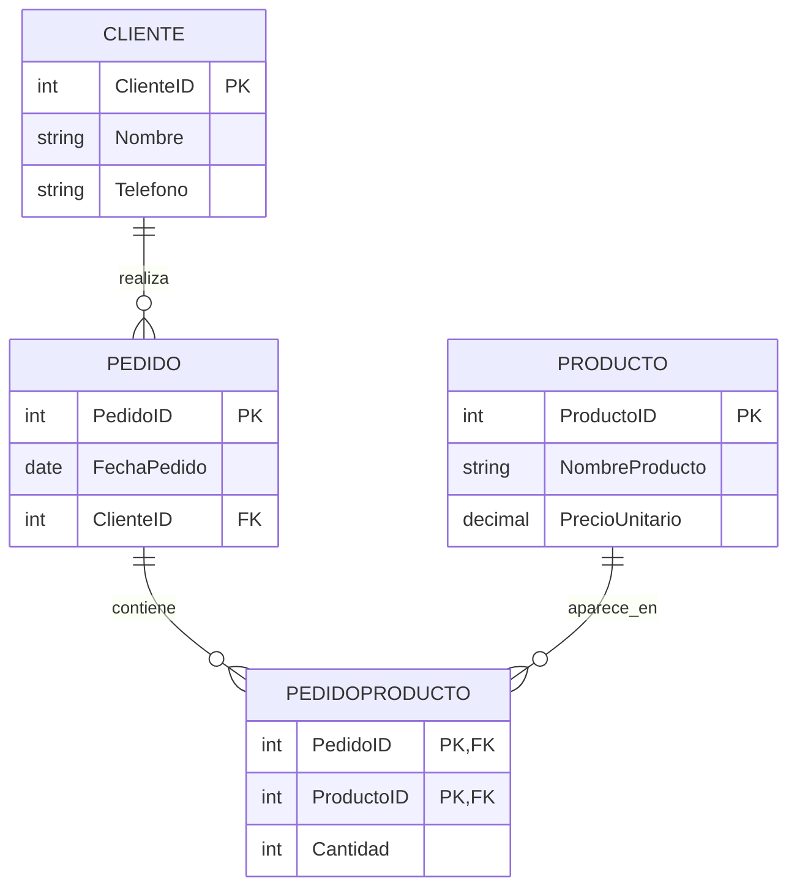

# **Normalización de Bases de Datos Relacional: Ejemplo Práctico Paso a Paso**

## **Introducción**

La normalización es un proceso fundamental en el diseño de bases de datos relacionales. Permite organizar los datos para reducir redundancias, evitar inconsistencias y facilitar el mantenimiento. Se realiza aplicando una serie de reglas conocidas como **formas normales** (1NF, 2NF, 3NF, etc.).

Este documento muestra, a través de un ejemplo práctico, cómo aplicar las formas normales paso a paso, ilustrando la evolución del modelo entidad-relación (E/R) y explicando especialmente el tratamiento del precio de los productos en la Tercera Forma Normal (3NF).

---

## **Situación Inicial (Sin Normalizar)**

Supongamos una tabla inicial para registrar pedidos de clientes:


| PedidoID | ClienteNombre | ClienteTel | Producto1 | Producto2 | FechaPedido |
| :-- | :-- | :-- | :-- | :-- | :-- |
| 1 | Ana Pérez | 555-1234 | Manzanas | Peras | 2025-05-01 |
| 2 | Luis Gómez | 555-5678 | Uvas |  | 2025-05-02 |

**Problemas:**

- Columnas Producto1 y Producto2 violan la atomicidad (más de un producto por pedido).
- Datos redundantes si un cliente hace varios pedidos.

**Esquema E/R inicial:**

- Entidad: Pedido
    - Atributos: PedidoID, ClienteNombre, ClienteTel, Producto1, Producto2, FechaPedido

---

## **Primera Forma Normal (1NF)**

**Regla:** Cada campo debe contener un valor atómico (indivisible) y no debe haber grupos repetidos.

**Transformación:**
Convertimos las columnas de productos en filas separadas.


| PedidoID | ClienteNombre | ClienteTel | Producto | FechaPedido |
| :-- | :-- | :-- | :-- | :-- |
| 1 | Ana Pérez | 555-1234 | Manzanas | 2025-05-01 |
| 1 | Ana Pérez | 555-1234 | Peras | 2025-05-01 |
| 2 | Luis Gómez | 555-5678 | Uvas | 2025-05-02 |

**Esquema E/R en 1NF:**

- Entidad: Pedido
    - Atributos: PedidoID, ClienteNombre, ClienteTel, Producto, FechaPedido

---

## **Segunda Forma Normal (2NF)**

**Regla:** Debe estar en 1NF y todos los atributos que no son clave deben depender completamente de la clave principal (eliminar dependencias parciales).

**Problema:**
ClienteNombre y ClienteTel dependen solo de PedidoID, no de la combinación PedidoID+Producto.

**Transformación:**
Se separa la información del cliente en una nueva entidad y se crea una relación entre Pedido y Cliente.

**Tablas resultantes:**

- **Cliente**
    - ClienteID (PK)
    - ClienteNombre
    - ClienteTel
- **Pedido**
    - PedidoID (PK)
    - ClienteID (FK)
    - FechaPedido
- **PedidoProducto**
    - PedidoID (PK, FK)
    - Producto

**Esquema E/R en 2NF:**

```
[Cliente]---(1,N)---[Pedido]---(1,N)---[PedidoProducto]
```


---

## **Tercera Forma Normal (3NF) y el Tratamiento del Precio**

**Regla:** Debe estar en 2NF y no debe haber dependencias transitivas (los atributos no clave dependen solo de la clave primaria y no entre sí).

### **Problema con el Precio**

Si en **PedidoProducto** añadimos un campo PrecioUnitario:


| PedidoID | Producto | PrecioUnitario |
| :-- | :-- | :-- |
| 1 | Manzanas | 2.00 |
| 1 | Peras | 1.50 |
| 2 | Uvas | 3.00 |

**Problema:**
El precio depende del producto, no de la clave compuesta (PedidoID + Producto). Esto es una dependencia transitiva.

### **Solución en 3NF**

El precio debe estar en la entidad **Producto**, no en **PedidoProducto**.

**Tablas resultantes:**

- **Producto**
    - ProductoID (PK)
    - NombreProducto
    - PrecioUnitario
- **PedidoProducto**
    - PedidoID (PK, FK)
    - ProductoID (PK, FK)
    - Cantidad (opcional)

**Esquema E/R en 3NF:**

```
[Cliente]---(1,N)---[Pedido]---(1,N)---[PedidoProducto]---(N,1)---[Producto]
                                                                      |
                                                                      ˅
                                                              PrecioUnitario
```

**Ventaja:**
Si el precio de un producto cambia, solo se actualiza en la tabla Producto. Los pedidos históricos reflejarán el precio actual, salvo que se requiera almacenar el precio de venta en el momento del pedido (en ese caso, se almacena el precio en PedidoProducto, pero esto es un diseño especial fuera de la normalización básica).

---

## **Resumen Visual de la Evolución**

| Paso | Entidades/Relaciones | Problemas Resueltos |
| :-- | :-- | :-- |
| Inicial | Pedido | Ninguno |
| 1NF | Pedido | Atomicidad, sin grupos repetidos |
| 2NF | Cliente, Pedido, PedidoProducto | Eliminación de dependencias parciales |
| 3NF | Cliente, Pedido, Producto, PedidoProducto | Eliminación de dependencias transitivas (precio) |


---

## **Aplicación en Bases de Datos Reales**

- **Reduce redundancia:** Cada dato se almacena una sola vez.
- **Facilita mantenimiento:** Cambios en los datos se hacen en un solo lugar.
- **Evita anomalías:** No hay inconsistencias al actualizar, insertar o borrar información.
- **Estructura lógica:** El modelo es claro, flexible y escalable.

---

## **Conclusión**

La normalización, aplicada paso a paso, transforma un esquema desorganizado en un modelo relacional robusto. La 3FN, en particular, garantiza que atributos como el precio de un producto estén correctamente ubicados, evitando redundancias y errores de actualización. Este proceso es esencial para el diseño de bases de datos eficientes y confiables en el mundo real.



