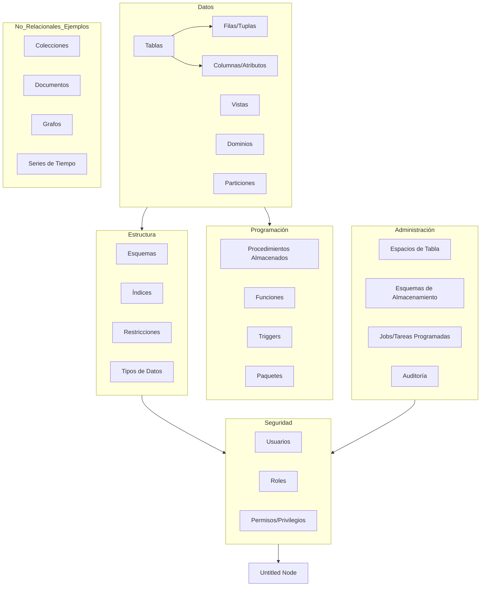

# DMINISTRACION DE  BASE DE DATOS. IFCD0310 
Repositorio para mantener la información del certificado de profesionalidad IFCT0310 - **Administrador de Base de Datos**
[Indice documentación (presentación Google)](https://docs.google.com/presentation/d/1yrxMqwIv4lkUsP8WN6mQDHwv0MbggUKrgXNLzzGTG5w/edit?usp=sharing)

## Estructura de certificado (Modulos y Unidades Formativas)

* [MF0223_3: Sistemas operativos y aplicaciones informáticas (170 horas)](./01-SO-Aplicaciones(MF0223)/)
    * UF1465: Computadores para bases de datos (60 horas)
    * UF1466: Sistemas de almacenamiento (70 horas)
    * UF1467: Aplicaciones microinformáticas e Internet para consulta y generación de documentación (40 horas)

* MF0224_3: Administración de sistemas gestores de bases de datos (200 horas)
    * [UF1468: Almacenamiento de la información e introducción a los SGBD (50 horas)](./02-SGBD-Administracion(MF0224)/01-Sistemas-Almacenamiento(UF1468)/)
    * [UF1469: SGDB e instalación (70 horas)](./02-SGBD-Administracion(MF0224)/02-SGBD-instalacion(UF1469)/)
    * [UF1470: Administración y monitorización de los SGBD (80 horas)](./02-SGBD-Administracion(MF0224)/03-SGBD-administracion(UF1470)/)
* MF0225_3: Gestión de bases de datos (200 horas)
    * UF1471: Bases de datos relacionales y modelado de datos (70 horas) 
    * UF1472: Lenguajes de definición y modificación de datos SQL (60 horas)
    * UF1473: Salvaguarda y seguridad de los datos (70 horas)

## Documentación adicional

### [Ejercicios](./EJERCICIOS/)

#### [00-cursos-alumnos](./EJERCICIOS/00-cursos-alumnos/) 
Procedimientos y funcionientos almacenados

#### [01-json-mongo](./EJERCICIOS/01-json-mongo/)
Ficheros JSON a MongoDB

### [API](./api/)

### [SQLite guía rápida](./SQLite/sqlite-presentacion.md)

### [procedimientos almacenados](./procedimientos/)

### [NODE.JS](./NODE.JS/)

## ESQUEMA

