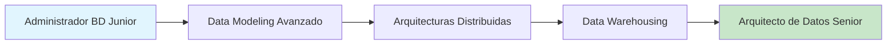
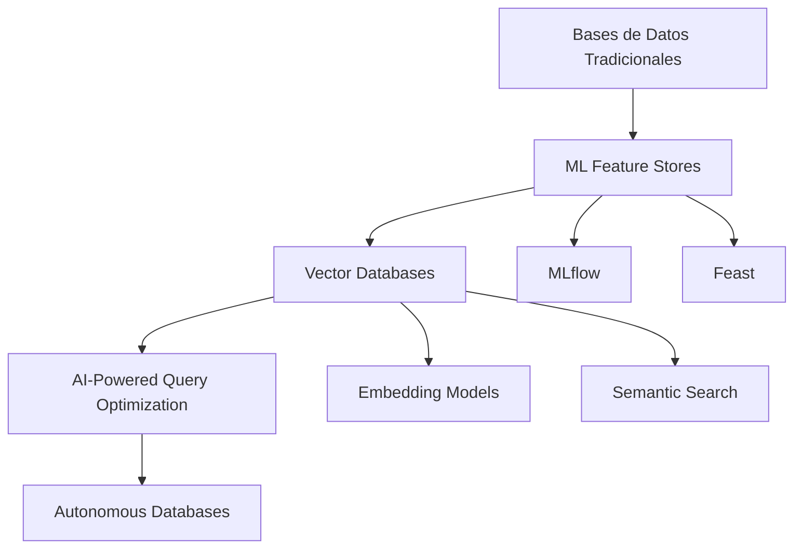
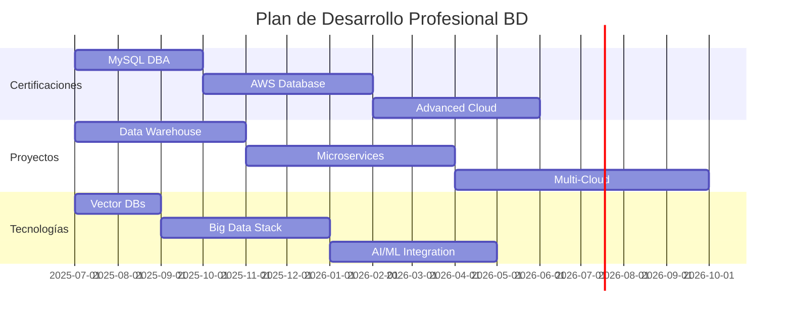

# 🚀 Siguientes Pasos de Aprendizaje - Post IFCT0310

> 🎯 **Ruta de especialización profesional para administradores de bases de datos**  
> Evoluciona de administrador junior a arquitecto senior de datos con esta hoja de ruta estructurada.

## 📖 Índice de Contenidos

- [Evaluación de Tu Nivel Actual](#-evaluación-de-tu-nivel-actual)
- [Rutas de Especialización](#-rutas-de-especialización)
- [Certificaciones Profesionales](#-certificaciones-profesionales)
- [Tecnologías Emergentes](#-tecnologías-emergentes)
- [Proyectos Prácticos Avanzados](#-proyectos-prácticos-avanzados)
- [Habilidades Complementarias](#-habilidades-complementarias)
- [Timeline de Progresión](#-timeline-de-progresión)
- [Recursos de Aprendizaje](#-recursos-de-aprendizaje)

## 🎯 Evaluación de Tu Nivel Actual

### ✅ **Conocimientos Base Adquiridos (IFCT0310)**
- [x] Administración básica de SGBD (MySQL, PostgreSQL, SQLite)
- [x] SQL intermedio y consultas complejas
- [x] Procedimientos almacenados básicos
- [x] Backup y recovery fundamentales
- [x] Seguridad básica y gestión de usuarios
- [x] Introducción a NoSQL (MongoDB)
- [x] Sistemas operativos para BD

### 🔄 **Siguiente Nivel - Objetivos a 12-24 meses**
- [ ] Arquitectura de datos empresarial
- [ ] Optimización avanzada de rendimiento
- [ ] Big Data y Analytics
- [ ] Cloud Computing para BD
- [ ] DevOps y automatización
- [ ] Machine Learning aplicado a datos

## 🛤️ Rutas de Especialización

### 🏗️ **1. Arquitecto de Datos** 
*Tiempo estimado: 18-24 meses*

**📚 Plan de Estudios:**
- **Meses 1-3:** Modelado de datos avanzado
  - Modelado dimensional (Kimball)
  - Data Vault 2.0
  - Normalización avanzada (4NF, 5NF)
  
- **Meses 4-9:** Arquitecturas distribuidas
  - Sharding y particionamiento
  - Replicación master-slave/master-master
  - Sistemas distribuidos (CAP theorem)
  
- **Meses 10-18:** Data Warehousing
  - ETL/ELT pipelines
  - OLAP vs OLTP
  - Dimensional modeling
  
- **Meses 19-24:** Arquitectura empresarial
  - Data governance
  - Metadata management
  - Enterprise data architecture

### ⚡ **2. Ingeniero de Rendimiento de BD**
*Tiempo estimado: 12-18 meses*

**🎯 Competencias Clave:**
- Tuning avanzado de consultas
- Optimización de índices complejos
- Análisis de planes de ejecución
- Monitorización en tiempo real
- Resolución de cuellos de botella

**📈 Tecnologías a Dominar:**
- **Herramientas de Profiling:** 
  - MySQL Performance Schema
  - PostgreSQL pg_stat_statements
  - Oracle AWR/ASH
  
- **Monitorización:**
  - Prometheus + Grafana
  - New Relic Database Monitoring
  - DataDog APM

### ☁️ **3. Especialista en BD Cloud**
*Tiempo estimado: 15-20 meses*

**🌐 Plataformas Cloud:**
- **AWS:** RDS, Aurora, DynamoDB, Redshift
- **Azure:** SQL Database, Cosmos DB, Synapse
- **GCP:** Cloud SQL, Firestore, BigQuery

**📋 Roadmap Cloud:**
1. **Fundamentos Cloud (Meses 1-3)**
   - Conceptos de infraestructura como código
   - Redes y seguridad en cloud
   - Modelos de servicio (IaaS, PaaS, SaaS)

2. **Bases de Datos Gestionadas (Meses 4-8)**
   - Migración de BD on-premise a cloud
   - Configuración de alta disponibilidad
   - Backup y disaster recovery en cloud

3. **Servicios Avanzados (Meses 9-15)**
   - Data Lakes y Data Warehouses
   - Streaming de datos en tiempo real
   - Machine Learning integrado

4. **Arquitectura Multi-Cloud (Meses 16-20)**
   - Estrategias híbridas
   - Sincronización entre clouds
   - Governance multi-cloud

### 🤖 **4. Data Engineer / Big Data**
*Tiempo estimado: 18-24 meses*

**🔧 Stack Tecnológico:**
- **Procesamiento:** Apache Spark, Kafka, Airflow
- **Almacenamiento:** Hadoop, Apache Parquet, Delta Lake
- **Streaming:** Apache Storm, Apache Flink
- **Orquestación:** Apache Airflow, Prefect, Dagster

## 🏆 Certificaciones Profesionales

### 🥇 **Certificaciones de Nivel Intermedio (6-12 meses)**

| Certificación | Proveedor | Duración Prep | Dificultad |
|---------------|-----------|---------------|------------|
| **MySQL Database Administrator** | Oracle | 3-4 meses | ⭐⭐⭐ |
| **PostgreSQL Associate** | PostgreSQL | 2-3 meses | ⭐⭐⭐ |
| **MongoDB Associate Developer** | MongoDB | 2-3 meses | ⭐⭐ |
| **AWS Certified Database - Specialty** | Amazon | 4-6 meses | ⭐⭐⭐⭐ |

### 🥈 **Certificaciones Avanzadas (12-18 meses)**

| Certificación | Proveedor | Duración Prep | Dificultad |
|---------------|-----------|---------------|------------|
| **Oracle Database Administrator** | Oracle | 6-8 meses | ⭐⭐⭐⭐⭐ |
| **Microsoft Azure Database Administrator** | Microsoft | 4-6 meses | ⭐⭐⭐⭐ |
| **Google Cloud Professional Data Engineer** | Google | 5-7 meses | ⭐⭐⭐⭐ |
| **Databricks Certified Associate** | Databricks | 3-4 meses | ⭐⭐⭐ |

## 🌟 Tecnologías Emergentes

### 🔥 **Trending Technologies 2025**

#### **1. Bases de Datos Vectoriales**
*Para aplicaciones de AI/ML*
- **Pinecone** - BD vectorial gestionada
- **Weaviate** - BD vectorial open source
- **Qdrant** - Motor de búsqueda vectorial
- **ChromaDB** - BD para embeddings

**🎯 Casos de Uso:**
- Búsqueda semántica
- Sistemas de recomendación
- RAG (Retrieval Augmented Generation)
- Análisis de similitud

#### **2. Edge Databases**
*Para aplicaciones IoT y edge computing*
- **EdgeDB** - BD relacional-objeto híbrida
- **PocketBase** - BD backend completo
- **TiKV** - Almacén clave-valor distribuido
- **CockroachDB** - BD distribuida global

#### **3. Real-time Databases**
*Para aplicaciones en tiempo real*
- **Apache Pinot** - OLAP en tiempo real
- **ClickHouse** - BD columnar analítica
- **Apache Druid** - BD para series temporales
- **QuestDB** - BD de series temporales

### 🧠 **AI/ML Integration**

## 🛠️ Proyectos Prácticos Avanzados

### 📊 **Proyecto 1: Data Warehouse Completo**
*Duración: 3-4 meses*

**🎯 Objetivos:**
- Diseñar e implementar un DW desde cero
- ETL pipelines con Apache Airflow
- Dashboard con Tableau/Power BI
- Optimización de consultas OLAP

**🛠️ Stack Tecnológico:**
- **Fuentes:** PostgreSQL, MySQL, APIs REST
- **ETL:** Apache Airflow, DBT
- **DW:** PostgreSQL/Snowflake
- **BI:** Tableau/Power BI

### 🚀 **Proyecto 2: Arquitectura Microservicios con BD**
*Duración: 4-5 meses*

**🎯 Objetivos:**
- Implementar patrón Database per Service
- Event Sourcing con Apache Kafka
- CQRS (Command Query Responsibility Segregation)
- Distributed transactions con Saga pattern

**🛠️ Stack Tecnológico:**
- **Microservicios:** Node.js/Python/Java
- **BD:** PostgreSQL, MongoDB, Redis
- **Messaging:** Apache Kafka
- **Orquestación:** Kubernetes

### 🌐 **Proyecto 3: Multi-Cloud Data Platform**
*Duración: 5-6 meses*

**🎯 Objetivos:**
- Deploy en AWS, Azure y GCP
- Sincronización de datos cross-cloud
- Disaster recovery automático
- Cost optimization strategies

**🛠️ Stack Tecnológico:**
- **AWS:** RDS, Aurora, S3
- **Azure:** SQL Database, Cosmos DB
- **GCP:** Cloud SQL, BigQuery
- **IaC:** Terraform, CloudFormation

## 💼 Habilidades Complementarias

### 🔧 **DevOps para BD**
- **Infrastructure as Code:** Terraform, Ansible
- **CI/CD para BD:** GitLab CI, GitHub Actions
- **Containerización:** Docker, Kubernetes
- **Monitoring:** Prometheus, Grafana, ELK Stack

### 📊 **Business Intelligence**
- **Herramientas BI:** Tableau, Power BI, Looker
- **Data Visualization:** D3.js, Plotly
- **Statistical Analysis:** R, Python (pandas, numpy)
- **Reporting:** SSRS, JasperReports

### 🔐 **Seguridad Avanzada**
- **Encryption:** TDE, Column-level encryption
- **Compliance:** GDPR, HIPAA, SOX
- **Access Control:** RBAC, ABAC
- **Auditing:** Database activity monitoring

### 💬 **Soft Skills**
- **Project Management:** Agile, Scrum
- **Communication:** Technical writing, presentations
- **Leadership:** Team management, mentoring
- **Problem Solving:** Root cause analysis

## 📅 Timeline de Progresión

### 🗓️ **Plan a 24 Meses**

### 🎯 **Hitos por Trimestre**

#### **Q3 2025 (Jul-Sep)**
- [ ] Completar certificación MySQL DBA
- [ ] Dominar Docker para BD
- [ ] Iniciar proyecto Data Warehouse
- [ ] Aprender bases de Terraform

#### **Q4 2025 (Oct-Dec)**
- [ ] Finalizar Data Warehouse project
- [ ] Iniciar preparación AWS Database Specialty
- [ ] Experimentar con Vector Databases
- [ ] Implementar monitoring con Prometheus

#### **Q1 2026 (Jan-Mar)**
- [ ] Obtener AWS Database Specialty
- [ ] Completar proyecto Microservices
- [ ] Dominar Apache Airflow
- [ ] Certificación Kubernetes (CKA)

#### **Q2 2026 (Apr-Jun)**
- [ ] Iniciar proyecto Multi-Cloud
- [ ] Especialización en Big Data (Spark)
- [ ] Advanced Azure certifications
- [ ] Mentoring junior developers

## 📚 Recursos de Aprendizaje

### 📖 **Libros Recomendados**

#### **Arquitectura de Datos**
- 📘 "Designing Data-Intensive Applications" - Martin Kleppmann
- 📕 "The Data Warehouse Toolkit" - Ralph Kimball
- 📗 "Building Evolutionary Architectures" - Neal Ford

#### **Performance y Optimización**
- 📙 "High Performance MySQL" - Baron Schwartz
- 📓 "PostgreSQL High Performance" - Gregory Smith
- 📔 "Effective SQL" - John Viescas

#### **Big Data y Analytics**
- 📒 "Spark: The Definitive Guide" - Bill Chambers
- 📰 "Stream Processing with Apache Kafka" - Guozhang Wang
- 📑 "The Lambda Architecture" - Nathan Marz

### 🎥 **Cursos Online Recomendados**

#### **Plataformas Premium**
- **Pluralsight:** Advanced Database Administration tracks
- **Udemy:** Cloud database specializations
- **Coursera:** Google Cloud / AWS database paths
- **Linux Academy:** DevOps for databases

#### **Contenido Gratuito**
- **YouTube Channels:**
  - Database Star (SQL y diseño)
  - Hussein Nasser (Backend engineering)
  - TechWorld with Nana (DevOps)
  
- **Documentación Oficial:**
  - PostgreSQL Tutorial
  - MySQL Documentation
  - MongoDB University

### 🏆 **Comunidades y Networking**

#### **Comunidades Online**
- **Stack Overflow:** Database tag participation
- **Reddit:** r/Database, r/PostgreSQL, r/MySQL
- **Discord:** Database communities
- **LinkedIn:** Database professionals groups

#### **Eventos y Conferencias**
- **Percona Live:** MySQL/PostgreSQL conference
- **MongoDB World:** NoSQL and document DBs
- **Data Engineering Podcast:** Weekly episodes
- **Local Meetups:** Database user groups

## 🎯 KPIs de Progreso

### 📊 **Métricas de Seguimiento**

| Métrica | Meta 6 meses | Meta 12 meses | Meta 24 meses |
|---------|--------------|---------------|---------------|
| **Certificaciones** | 1 | 2-3 | 4-5 |
| **Proyectos Portfolio** | 1 | 2 | 3-4 |
| **Tecnologías Dominadas** | +2 | +4 | +6 |
| **Contribuciones Open Source** | 5 | 15 | 30 |
| **Blog Posts Técnicos** | 2 | 6 | 12 |
| **Speaking/Workshops** | 0 | 1 | 3 |

### 💰 **Expectativas Salariales**

| Nivel | Experiencia | Salario España | Salario Remote |
|-------|-------------|----------------|----------------|
| **Junior DBA** | 0-2 años | €25-35K | €30-40K |
| **Mid-level DBA** | 2-5 años | €35-50K | €45-65K |
| **Senior DBA** | 5-8 años | €50-70K | €65-85K |
| **Data Architect** | 8+ años | €70-90K | €85-120K |
| **Principal/Staff** | 10+ años | €90K+ | €120K+ |

## 🚀 Primeros Pasos Inmediatos

### ✅ **Esta Semana (Acciones Inmediatas)**
1. **Configura tu entorno de desarrollo:**
   - [ ] Instala Docker Desktop
   - [ ] Configura PostgreSQL en Docker
   - [ ] Instala DBeaver o DataGrip
   - [ ] Crea cuenta en GitHub para portfolio

2. **Define tu especialización:**
   - [ ] Evalúa tu interés: Cloud, Big Data, o Performance
   - [ ] Investiga ofertas de trabajo en tu zona
   - [ ] Identifica tecnologías más demandadas
   - [ ] Elige tu primera certificación

3. **Prepara tu learning path:**
   - [ ] Descarga libros recomendados
   - [ ] Suscríbete a canales de YouTube relevantes
   - [ ] Únete a comunidades online
   - [ ] Crea calendario de estudio

### 📝 **Este Mes (Plan 30 días)**
1. **Proyecto inicial:**
   - Migra una BD pequeña a Docker
   - Implementa backup automatizado
   - Configura monitoring básico
   - Documenta el proceso

2. **Preparación para certificación:**
   - Elige tu primera cert (MySQL/PostgreSQL)
   - Compra material de estudio
   - Crea plan de estudios semanal
   - Programa fecha de examen

## 🎉 Conclusión

El certificado IFCT0310 te ha dado una base sólida, pero el mundo de las bases de datos evoluciona constantemente. Esta hoja de ruta te guiará hacia roles senior con salarios competitivos y proyectos desafiantes.

**🔑 Claves para el Éxito:**
- **Consistencia:** Estudia al menos 10 horas/semana
- **Práctica:** Cada concepto debe tener un proyecto asociado
- **Networking:** Conecta con profesionales senior
- **Documentación:** Mantén un blog técnico de tu progreso

---

**¡Tu carrera en bases de datos apenas comienza! 🚀**

---

💡 <strong>Recuerda:</strong> El aprendizaje continuo es la clave del éxito en tecnología. ¡Nunca pares de aprender!

