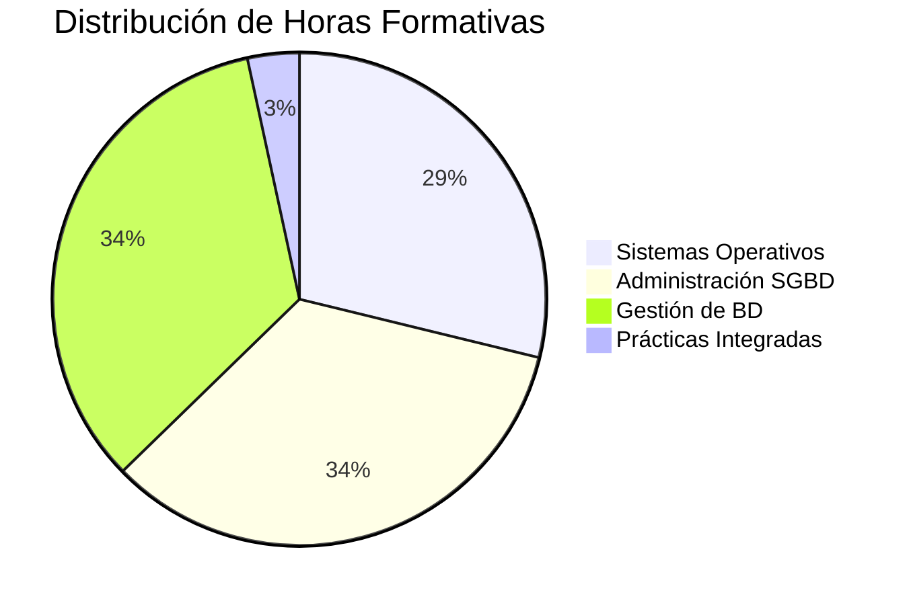
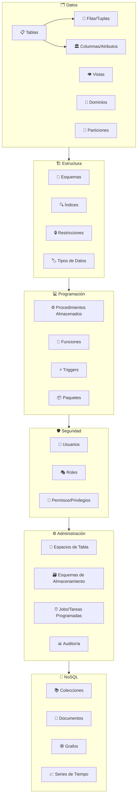

# 🗄️ Administrador de Base de Datos - IFCT0310

> 📚 **Repositorio de apoyo al Certificado de Profesionalidad en Administración de Bases de Datos**  
> Material didáctico, ejercicios prácticos y documentación técnica para el desarrollo completo del programa formativo.

## 📖 Índice de Contenidos

- [Descripción General](#-descripción-general)
- [Estructura del Curso](#-estructura-del-curso)
- [Tecnologías Utilizadas](#-tecnologías-utilizadas)
- [Módulos Formativos](#-módulos-formativos)
- [Herramientas de Desarrollo](#-herramientas-de-desarrollo)
- [Recursos Adicionales](#-recursos-adicionales)
- [Contribución](#-contribución)
- [Licencia](#-licencia)

## 🎯 Descripción General

Este repositorio contiene todo el material de apoyo para el **Certificado de Profesionalidad IFCT0310 - Administrador de Base de Datos**, un programa formativo de **590 horas** diseñado para formar profesionales especializados en la administración, gestión y mantenimiento de sistemas de bases de datos.

### 🎓 Objetivos de Aprendizaje

- **Dominar** los fundamentos de sistemas operativos aplicados a bases de datos
- **Administrar** sistemas gestores de bases de datos relacionales y NoSQL
- **Gestionar** bases de datos con SQL y técnicas avanzadas
- **Implementar** medidas de seguridad y salvaguarda de datos
- **Desarrollar** procedimientos almacenados y funciones
- **Optimizar** el rendimiento de bases de datos

## 🏗️ Estructura del Curso

### 📊 Distribución de Horas por Módulo

## 🛠️ Tecnologías Utilizadas

### Sistemas Gestores de Bases de Datos
- 
- 
- 
- 

### Lenguajes y Herramientas
- 
- 
- 
- 

## 📚 Módulos Formativos

### 🖥️ [MF0223_3: Sistemas Operativos y Aplicaciones Informáticas](01-SO-Aplicaciones(MF0223)) (170 horas)

**Unidades Formativas:**
- **UF1465:** Computadores para bases de datos (60h)
  - Arquitectura de sistemas
  - Hardware especializado para BD
  - Configuración y optimización

- **UF1466:** Sistemas de almacenamiento (70h)
  - Tipos de almacenamiento
  - RAID y configuraciones
  - Sistemas de archivos

- **UF1467:** Aplicaciones microinformáticas e Internet (40h)
  - Herramientas de documentación
  - Consulta de información técnica
  - Generación de reportes

### 🔧 MF0224_3: Administración de Sistemas Gestores de Bases de Datos (200 horas)

**Contenidos principales:**
- Instalación y configuración de SGBD
- Administración de usuarios y permisos
- Monitorización y optimización del rendimiento
- Mantenimiento preventivo y correctivo
- Backup y recovery procedures

### 📊 MF0225_3: Gestión de Bases de Datos (200 horas)

**Unidades Formativas:**
- **UF1471:** Bases de datos relacionales y modelado (70h)
  - Modelo entidad-relación
  - Normalización de datos
  - Diseño de esquemas

- **UF1472:** Lenguajes SQL (60h)
  - DDL (Data Definition Language)
  - DML (Data Manipulation Language)
  - DCL (Data Control Language)
  - Consultas complejas y optimización

- **UF1473:** Salvaguarda y seguridad (70h)
  - Políticas de backup
  - Estrategias de recuperación
  - Seguridad y auditoría

## 🔧 Herramientas de Desarrollo

### Entornos de Desarrollo
- **phpMyAdmin** - Administración web para MySQL
- **pgAdmin** - Herramienta de administración para PostgreSQL
- **MongoDB Compass** - GUI para MongoDB
- **DBeaver** - Cliente universal de bases de datos

### Sistemas Operativos Utilizados
- **Linux Ubuntu/CentOS** - Servidores de producción
- **Windows Server** - Entornos empresariales
- **macOS** - Desarrollo local

## 📈 Conceptos Avanzados Cubiertos

### Arquitectura de Bases de Datos

### Procedimientos y Funciones Almacenadas
- Desarrollo de lógica de negocio en el servidor
- Optimización de consultas complejas
- Implementación de triggers para integridad referencial
- Manejo de excepciones y transacciones

### Migración de Ficheros JSON a MongoDB
- Importación masiva de datos
- Transformación de estructuras relacionales a documentos
- Optimización de esquemas NoSQL
- Indexación estratégica

## 📖 Recursos Adicionales

### 📑 Documentación Oficial
- [📊 Índice de Documentación (Google Slides)](https://docs.google.com/presentation/d/1yrxMqwIv4lkUsP8WN6mQDHwv0MbggUKrgXNLzzGTG5w/edit?usp=sharing)
- [MySQL Documentation](https://dev.mysql.com/doc/)
- [PostgreSQL Documentation](https://www.postgresql.org/docs/)
- [MongoDB Manual](https://docs.mongodb.com/manual/)

### 🛠️ Herramientas Online
- [SQLite Online](https://sqliteonline.com/)
- [DB Fiddle](https://www.db-fiddle.com/)
- [MongoDB Playground](https://mongoplayground.net/)

### 📚 Lecturas Recomendadas
- "Database System Concepts" - Silberschatz, Galvin, Gagne
- "MySQL High Performance" - Baron Schwartz
- "PostgreSQL: Up and Running" - Regina Obe, Leo Hsu

## 🎯 Competencias Desarrolladas

### Técnicas
- ✅ **Diseño de bases de datos** relacionales y NoSQL
- ✅ **Optimización de consultas** SQL complejas
- ✅ **Administración de sistemas** gestores de BD
- ✅ **Implementación de seguridad** y control de acceso
- ✅ **Desarrollo de procedimientos** almacenados
- ✅ **Gestión de backup y recovery**

### Transversales
- ✅ **Resolución de problemas** técnicos complejos
- ✅ **Análisis y diseño** de soluciones escalables
- ✅ **Documentación técnica** detallada
- ✅ **Trabajo en equipo** y metodologías ágiles

## 🚀 Proyectos Destacados

### 🏪 Sistema de Gestión Comercial
- Base de datos completa para gestión de inventarios
- Implementación en MySQL con más de 15 tablas relacionadas
- Procedimientos almacenados para cálculos automatizados

### 📊 Dashboard de Analytics
- Migración de datos históricos a MongoDB
- Agregaciones complejas para reportes en tiempo real
- Optimización de consultas con índices compuestos

### 🔐 Sistema de Auditoría
- Implementación de triggers para logging automático
- Control granular de permisos por roles
- Políticas de retención de datos automáticas

## 📊 Estadísticas del Curso

| Métrica | Valor |
|---------|-------|
| **Duración Total** | 590 horas |
| **Módulos Formativos** | 3 |
| **Unidades Formativas** | 6 |
| **Tecnologías Dominadas** | 4+ SGBD |
| **Proyectos Desarrollados** | 15+ |
| **Líneas de Código SQL** | 5,000+ |

## 👨‍🏫 Sobre el Instructor

**Alberto Mozo** - Instructor especializado en Bases de Datos
- 🎓 Experto en administración de SGBD
- 💼 Experiencia en proyectos empresariales
- 📚 Formador certificado en tecnologías de bases de datos

## 🤝 Contribución

Las contribuciones son bienvenidas. Para contribuir:

1. **Fork** el repositorio
2. **Crea** una rama para tu funcionalidad (`git checkout -b feature/nueva-funcionalidad`)
3. **Commit** tus cambios (`git commit -am 'Añade nueva funcionalidad'`)
4. **Push** a la rama (`git push origin feature/nueva-funcionalidad`)
5. **Abre** un Pull Request

## 📝 Código de Conducta

Este proyecto se adhiere al código de conducta de código abierto. Al participar, se espera que mantengas este código.

## 📄 Licencia

Este proyecto está bajo la Licencia MIT - mira el archivo [LICENSE](LICENSE) para más detalles.

## 🙏 Agradecimientos

- **SEPE** - Por el programa de certificación profesional
- **Comunidad de desarrolladores** - Por las herramientas open source
- **Estudiantes** - Por su dedicación y feedback continuo

---

**¡Gracias por formar parte de este viaje de aprendizaje en Bases de Datos!**

---

💡 <strong>Tip:</strong> Si este repositorio te ha sido útil, ¡considera darle una estrella! ⭐

